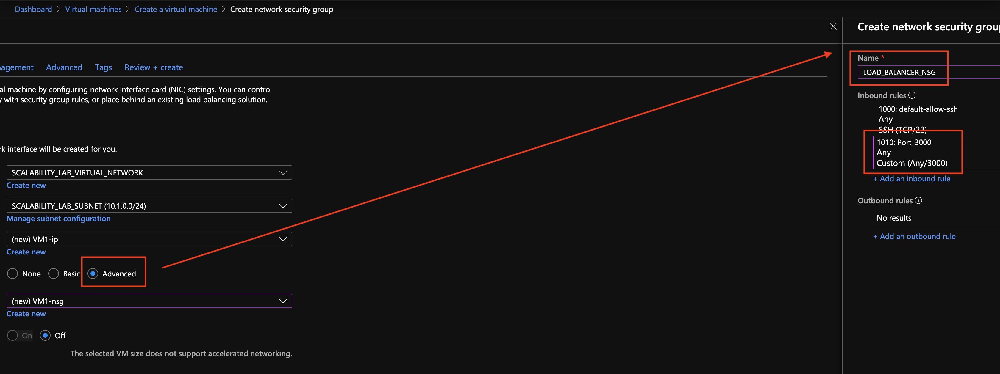

### Escuela Colombiana de Ingeniería
### Arquitecturas de Software - ARSW

# Laboratorio 8 ARSW

## Integrantes

*   Juan Sebastián Frásica Galeano
*   Daniel Felipe Walteros Trujillo

## Escalamiento en Azure con Maquinas Virtuales, Sacale Sets y Service Plans

### Dependencias
* Cree una cuenta gratuita dentro de Azure. Para hacerlo puede guiarse de esta [documentación](https://azure.microsoft.com/en-us/free/search/?&ef_id=Cj0KCQiA2ITuBRDkARIsAMK9Q7MuvuTqIfK15LWfaM7bLL_QsBbC5XhJJezUbcfx-qAnfPjH568chTMaAkAsEALw_wcB:G:s&OCID=AID2000068_SEM_alOkB9ZE&MarinID=alOkB9ZE_368060503322_%2Bazure_b_c__79187603991_kwd-23159435208&lnkd=Google_Azure_Brand&dclid=CjgKEAiA2ITuBRDchty8lqPlzS4SJAC3x4k1mAxU7XNhWdOSESfffUnMNjLWcAIuikQnj3C4U8xRG_D_BwE). Al hacerlo usted contará con $200 USD para gastar durante 1 mes.

### Parte 0 - Entendiendo el escenario de calidad

Adjunto a este laboratorio usted podrá encontrar una aplicación totalmente desarrollada que tiene como objetivo calcular el enésimo valor de la secuencia de Fibonnaci.

**Escalabilidad**
Cuando un conjunto de usuarios consulta un enésimo número (superior a 1000000) de la secuencia de Fibonacci de forma concurrente y el sistema se encuentra bajo condiciones normales de operación, todas las peticiones deben ser respondidas y el consumo de CPU del sistema no puede superar el 70%.

### Parte 1 - Escalabilidad vertical

1. Diríjase a el [Portal de Azure](https://portal.azure.com/) y a continuación cree una maquina virtual con las características básicas descritas en la imágen 1 y que corresponden a las siguientes:
    * Resource Group = SCALABILITY_LAB
    * Virtual machine name = VERTICAL-SCALABILITY
    * Image = Ubuntu Server 
    * Size = Standard B1ls
    * Username = scalability_lab
    * SSH publi key = Su llave ssh publica


2. Para conectarse a la VM use el siguiente comando, donde las `x` las debe remplazar por la IP de su propia VM.

    `ssh scalability_lab@xxx.xxx.xxx.xxx`

3. Instale node, para ello siga la sección *Installing Node.js and npm using NVM* que encontrará en este [enlace](https://linuxize.com/post/how-to-install-node-js-on-ubuntu-18.04/).
4. Para instalar la aplicación adjunta al Laboratorio, suba la carpeta `FibonacciApp` a un repositorio al cual tenga acceso y ejecute estos comandos dentro de la VM:

    `git clone <your_repo>`

    `cd <your_repo>/FibonacciApp`

    `npm install`

5. Para ejecutar la aplicación puede usar el comando `npm FibinacciApp.js`, sin embargo una vez pierda la conexión ssh la aplicación dejará de funcionar. Para evitar ese compartamiento usaremos *forever*. Ejecute los siguientes comando dentro de la VM.

    `npm install forever -g`

    `forever start FibinacciApp.js`

6. Antes de verificar si el endpoint funciona, en Azure vaya a la sección de *Networking* y cree una *Inbound port rule* tal como se muestra en la imágen. Para verificar que la aplicación funciona, use un browser y user el endpoint `http://xxx.xxx.xxx.xxx:3000/fibonacci/6`. La respuesta debe ser `The answer is 8`.


7. La función que calcula en enésimo número de la secuencia de Fibonacci está muy mal construido y consume bastante CPU para obtener la respuesta. Usando la consola del Browser documente los tiempos de respuesta para dicho endpoint usando los siguintes valores:
    * 1000000
    
    B1ls:
    
    
    
    B2ms:
    
    
      
    * 1010000
    
    B1ls:
    
    
    
    B2ms:
    
    
    
    * 1020000
    
    B1ls:
    
    
    
    B2ms:
    
    
    
    * 1030000
    
    B1ls:
    
    
    
    B2ms:
    
    
    
    * 1040000
    
    B1ls:
    
    
    
    B2ms:
    
    
    
    * 1050000
    
    B1ls:
    
    
    
    B2ms:
    
    
    
    * 1060000
    
    B1ls:
    
    
    
    B2ms:
    
    
    
    * 1070000
    
    B1ls:
    
    
    
    B2ms:
    
    
    
    * 1080000
    
    B1ls:
    
    
    
    B2ms:
    
    
    
    * 1090000   
    
    B1ls:
    
    
    
    B2ms:
    
    

8. Dírijase ahora a Azure y verifique el consumo de CPU para la VM. (Los resultados pueden tardar 5 minutos en aparecer).


9. Ahora usaremos Postman para simular una carga concurrente a nuestro sistema. Siga estos pasos.
    * Instale newman con el comando `npm install newman -g`. Para conocer más de Newman consulte el siguiente [enlace](https://learning.getpostman.com/docs/postman/collection-runs/command-line-integration-with-newman/).
    * Diríjase hasta la ruta `FibonacciApp/postman` en una maquina diferente a la VM.
    * Para el archivo `[ARSW_LOAD-BALANCING_AZURE].postman_environment.json` cambie el valor del parámetro `VM1` para que coincida con la IP de su VM.
    * Ejecute el siguiente comando.

    ```
    newman run ARSW_LOAD-BALANCING_AZURE.postman_collection.json -e [ARSW_LOAD-BALANCING_AZURE].postman_environment.json -n 10 &
    newman run ARSW_LOAD-BALANCING_AZURE.postman_collection.json -e [ARSW_LOAD-BALANCING_AZURE].postman_environment.json -n 10
    ```

10. La cantidad de CPU consumida es bastante grande y un conjunto considerable de peticiones concurrentes pueden hacer fallar nuestro servicio. Para solucionarlo usaremos una estrategia de Escalamiento Vertical. En Azure diríjase a la sección *size* y a continuación seleccione el tamaño `B2ms`.


11. Una vez el cambio se vea reflejado, repita el paso 7, 8 y 9.
12. Evalue el escenario de calidad asociado al requerimiento no funcional de escalabilidad y concluya si usando este modelo de escalabilidad logramos cumplirlo.

   Al realizar el cambio de tamaño de la VM a B2ms, ejecutando las pruebas concurrentes con Newman se evidenció que la cantidad máxima de uso de la CPU fue de 49.2%, esto satisface el procentaje limite de 70% en el escenario de calidad establecido en el laboratorio.
   
   Ahora, tomando en cuenta que el escenario de calidad dice que todas las peticiones deben ser respondidas y aún se encontraton fallos al haber incrementado la capacidad de la VM, se puede concluir que el escenario de calidad no fue satisfecho.

13. Vuelva a dejar la VM en el tamaño inicial para evitar cobros adicionales.

**Preguntas**

1. ¿Cuántos y cuáles recursos crea Azure junto con la VM?
   
   Azure crea 4 recursos por defecto junto con la máquina virtual, estos son:

   * Virtual Network
   * Public IP Address
   * Disk
   * Storage Account
   * Network Security Group
   * Network Interface
   
   Para acceder a la máquina virtual se requiere un par de llaves, se puede generar individualmente o creando el recurso SSH Key con Azure.
   
   
2. Brevemente describa para qué sirve cada recurso

   Virtual Network: Sirve para realizar comunicación entre recursos de azure como Azure Virtual Machines, es como una red simple, sin embargo ofrece beneficios adicionales como escalabilidad, aislamiento y disponibilidad.
   
   Public IP Address: Permite que los recursos de azure se comuniquen con internet por medio de una IP pública, de esta forma cualquier persona tiene acceso a esa máquina por los puertos definidos, esta dirección es asignada hasta que se elimine. Un recurso de dirección IP pública se puede asociar con interfaces de redes de máquinas virtuales, balanceadores de carga orientados a Internet, pasarelas VPN, pasarelas de aplicación, cortafuegos Azure.
   
   Disk: Sistema que se encarga del almacenamiento de la máquina virtual Azure.

   Storage Account: Contiene todos los objetos de datos de Azure Storage: blobs, archivos, colas, tablas y discos. Proporciona un espacio de nombres único para sus datos de Azure Storage al que se puede acceder desde cualquier lugar del mundo por medio de los protocolos que se hayan defindio.

   Network Security Group: Sistema que realiza la función de in firewall para redes On Cloud, filtra el tráfico de salida y entrada de los recursos de una red virtual de Azure, lo hace por medio de grupos de seguridad que definen estas reglas.

   Network Interface: Establece la conexión entre una máquina virtual Azure con el Internet y con otros recursos locales.
   
   SSH Key: Par de llaves para controlar acceso a la máquina virtual por medio de un sistema de cifrado asimétrico, azure guarda la llave pública en el acceso SSH de la máquina virtual y te permite descargar la llave privada solo al momento de crear la máquina virtual; no la almacena en ningún lado.
   
3. Al cerrar la conexión ssh con la VM, ¿por qué se cae la aplicación que ejecutamos con el comando `npm FibonacciApp.js`? ¿Por qué debemos crear un *Inbound port rule* antes de acceder al servicio?

   Porque el proceso realizado al ejecutar tal comando se mantiene conforme la sesión, que en este caso fue reaizada por SSH, se mantenga; esto implica que al cerrar la conexión todos los procesos creados por este usuario también desaparecen.
   
   Al crear una VM en Azure, el grupo de seguridad definido restringe todas las conexiones por defecto, solo omite las definidas al crear la VM; debido a que NodeJS se ejecuta por el puerto 3000, para obtener acceso público a la aplicación desplegada con NodeJS en el VM, se requiere crear la regla de entrada por este puerto.

4. Adjunte tabla de tiempos e interprete por qué la función tarda tando tiempo.

   | N       | B1ls(s) | B2ms(s) |
    |---------|---------|---------|
    | 1000000 | 23.59   | 45.37   |
    | 1010000 | 25.86   | 26.66   |
    | 1020000 | 53.72   | 18.09   |
    | 1030000 | 26.36   | 27.09   |
    | 1040000 | 62.00   | 19.61   |
    | 1050000 | 27.72   | 21.31   |
    | 1060000 | 27.48   | 20.77   |
    | 1070000 | 28.24   | 35.83   |
    | 1080000 | 52.83   | 21.71   |
    | 1090000 | 29.79   | 57.91   |
    
    La función se demora tanto tiempo porque calcula el número de fibonacci de forma iterativa, lo cual hace que con números muy grandes se demore tiempos excesivos, pues su complejidad es lineal.

5. Adjunte imágen del consumo de CPU de la VM e interprete por qué la función consume esa cantidad de CPU.

   Antes de realizar escalamiento vertical:
   
   
   
   Maximo uso de CPU de 93.4%
   
   Despues de realizar escalamiento vertical:
   
   
   
   Maximo uso de CPU de 49.2%

6. Adjunte la imagen del resumen de la ejecución de Postman. Interprete:
    * Tiempos de ejecución de cada petición.
    * Si hubo fallos documentelos y explique.
   
    Antes de realizar escalamiento vertical:
   
   
   
   Hubo un total de 3 fallos y la ejecución de cada pertición tomo en promedio 50.08 segundos.
   
   Despues de realizar escalamiento vertical:
   
   
   
   Hubo un total de 4 fallos y la ejecución de cada pertición tomo en promedio 27.04 segundos.
   
   De esto se puede interpretar que al incrementar la capacidad de la VM, los tiempos de respuesta mejoran; pero debido a la complejidad de la función utilizada, con algunos números siguen ocurriendo fallos al realizar calculos muy grandes.
   
7. ¿Cuál es la diferencia entre los tamaños `B2ms` y `B1ls` (no solo busque especificaciones de infraestructura)?

   La máquina B1ls es mas económica y tiene menos capacidad que la máquina B2ms, además solo está disponible para linux a diferencia de la B2ms.

    | Name | vCpu (núcleos) | Ram | Discos de datos | E/S máxima por segundo | Almacenamiento temporal (GiB) | Costo/Mes ($) |
    |------|----------------|-----|-----------------|------------------------|-------------------------------|---------------|
    | B2ms | 2              | 8   | 4               | 1920                   | 16                            | 72.85         |
    | B1ls | 1              | 0.5 | 2               | 160                    | 4                             | 4.56          |

    Ambas máquinas son de uso general, y proporcionan un uso equilibrado de la CPU, por lo general el tráfico soportado por estas es bajo/medio.

8. ¿Aumentar el tamaño de la VM es una buena solución en este escenario?, ¿Qué pasa con la FibonacciApp cuando cambiamos el tamaño de la VM?

   No es una buena solución cambiar el tamaño, porque debido a la implementación del algoritmo (complejidad lineal) y el hecho de que no se usaron sistemas de concurrencia, al incrementar la capacidad solo mejoraron los tiempos de respuesta, pero siguió habiendo fallos.

   Cuando cambiamos el tamaño de la máquina virtual es necesario reiniciarla, por lo tanto se pierde disponibilidad de la aplicación ya que esta deja de funcionar mientras se reinicia.

9. ¿Qué pasa con la infraestructura cuando cambia el tamaño de la VM? ¿Qué efectos negativos implica?

   Debido a que cambia la cantidad de procesadores y memoria asignados al cambiar el tamaño de la VM, esta se debe reiniciar; lo cual implica la pérdida de los archivos temporales que se tenian dentro de la VM y la pérdida de disponibilidad de los servicios que ejecuta. A gran escala esto significa perdidas de datos no persistidos como sistemas de caché y posibles perdidas financieras por haber causado un tiempo sin disponibilidad de la aplicación ofrecida.

10. ¿Hubo mejora en el consumo de CPU o en los tiempos de respuesta? Si/No ¿Por qué?

   Efectivamente hubo una mejora con respecto al consumo de CPU, gracias en su mayoría a la capacidad de procesamiento de la VM con tamaño B2ms. Realizando las pruebas con newman el uso de la CPU disminuyo de 93.35% a 49.15%, esto implica que se satisface efectivamente el escenario de calidad del ejericio.

11. Aumente la cantidad de ejecuciones paralelas del comando de postman a `4`. ¿El comportamiento del sistema es porcentualmente mejor?

   
   
   Al tener una menor cantidad de solicitudes si mejoro, pero se puede apreciar que sigue fallando, esto representa que la función utilizada para calcular los números de fibonacci debe ser optimizada para mejorar el rendimiento.

### Parte 2 - Escalabilidad horizontal

#### Crear el Balanceador de Carga

Antes de continuar puede eliminar el grupo de recursos anterior para evitar gastos adicionales y realizar la actividad en un grupo de recursos totalmente limpio.

1. El Balanceador de Carga es un recurso fundamental para habilitar la escalabilidad horizontal de nuestro sistema, por eso en este paso cree un balanceador de carga dentro de Azure tal cual como se muestra en la imágen adjunta.


2. A continuación cree un *Backend Pool*, guiese con la siguiente imágen.


3. A continuación cree un *Health Probe*, guiese con la siguiente imágen.


4. A continuación cree un *Load Balancing Rule*, guiese con la siguiente imágen.


5. Cree una *Virtual Network* dentro del grupo de recursos, guiese con la siguiente imágen.


#### Crear las maquinas virtuales (Nodos)

Ahora vamos a crear 3 VMs (VM1, VM2 y VM3) con direcciones IP públicas standar en 3 diferentes zonas de disponibilidad. Después las agregaremos al balanceador de carga.

1. En la configuración básica de la VM guíese por la siguiente imágen. Es importante que se fije en la "Avaiability Zone", donde la VM1 será 1, la VM2 será 2 y la VM3 será 3.


2. En la configuración de networking, verifique que se ha seleccionado la *Virtual Network*  y la *Subnet* creadas anteriormente. Adicionalmente asigne una IP pública y no olvide habilitar la redundancia de zona.


3. Para el Network Security Group seleccione "avanzado" y realice la siguiente configuración. No olvide crear un *Inbound Rule*, en el cual habilite el tráfico por el puerto 3000. Cuando cree la VM2 y la VM3, no necesita volver a crear el *Network Security Group*, sino que puede seleccionar el anteriormente creado.



4. Ahora asignaremos esta VM a nuestro balanceador de carga, para ello siga la configuración de la siguiente imágen.


5. Finalmente debemos instalar la aplicación de Fibonacci en la VM. para ello puede ejecutar el conjunto de los siguientes comandos, cambiando el nombre de la VM por el correcto

```
git clone https://github.com/daprieto1/ARSW_LOAD-BALANCING_AZURE.git

curl -o- https://raw.githubusercontent.com/creationix/nvm/v0.34.0/install.sh | bash
source /home/vm1/.bashrc
nvm install node

cd ARSW_LOAD-BALANCING_AZURE/FibonacciApp
npm install

npm install forever -g
forever start FibonacciApp.js
```

Realice este proceso para las 3 VMs, por ahora lo haremos a mano una por una, sin embargo es importante que usted sepa que existen herramientas para aumatizar este proceso, entre ellas encontramos Azure Resource Manager, OsDisk Images, Terraform con Vagrant y Paker, Puppet, Ansible entre otras.

#### Probar el resultado final de nuestra infraestructura

1. Por supuesto, el endpoint de acceso a nuestro sistema será la IP pública del balanceador de carga, primero verifiquemos que los servicios básicos están funcionando, consuma los siguientes recursos:

```
http://20.54.88.127/
```


```
http://20.54.88.127/fibonacci/1
```


2. Realice las pruebas de carga con `newman` que se realizaron en la parte 1 y haga un informe comparativo donde contraste: tiempos de respuesta, cantidad de peticiones respondidas con éxito, costos de las 2 infraestrucruras, es decir, la que desarrollamos con balanceo de carga horizontal y la que se hizo con una maquina virtual escalada.

### Informe

### Resultados Newman con Escalabilidad Vertical


Cada solicitud se demoro en promedio 27.4 segundos y hubo 4 solicitudes fallidas.

#### Costo mensual de esta infraestructura

   | Tipo de Servicio | Región | Descripción | Costo Estimado Mensual |
   |------|----------------|-----|-----------------|
   | Virtual Machines | East US 2 | 1 B2MS (2 vCPUs, 8 GB RAM) x 730 Hours; Linux – Ubuntu; Pay as you go; 0 managed OS disks – S4, 100 transaction units; 5 GB Bandwidth | $60.79 |
   | Virtual Network |               | 100 GB data transfer from East US region to East US region | $2.00 |
   | IP Addresses | East US 2 | 0 Dynamic IP Addresses, 1 Static IP Addresses, 0 Remaps | $2.63 |
   | Storage Accounts | East US 2 | Managed Disks, Standard HDD, S4 Disk Type 1 Disks, Pay as you go | $1.59 |
   | Support |             | Support | $0.00 |
   | Total |             | | $67.00 |

### Resultados Newman con Escalabilidad Horizontal


Cada solicitud se demoro en promedio 26.8 segundos y no hubo solicitudes fallidas.

#### Costo mensual de esta infraestructura

   | Tipo de Servicio | Región | Descripción | Costo Estimado Mensual |
   |------|----------------|-----|-----------------|
   | Virtual Machines | North Europe | 3 B1LS (1 vCPU, 0.5 GB RAM) x 730 Hours; Linux – Ubuntu; Pay as you go; 0 managed OS disks – S4, 100 transaction units; 5 GB Bandwidth | $12.48 |
   | Virtual Network |               | 100 GB data transfer from East US region to East US region | $2.00 |
   | IP Addresses | North Europe | 4 Dynamic IP Addresses, 1 Static IP Addresses, 0 Remaps | $11.39 |
   | Storage Accounts | North Europe| Managed Disks, Standard HDD, S4 Disk Type 1 Disks, Pay as you go | $1.59 |
   | Load Balancer | North Europe| Basic Load Balancer is free of charge | $0.00 |
   | Support |             | Support | $0.00 |
   | Total |             | | $27.45 |
   
### Conclusiones

   * Entre las dos infraestructuras implementadas no hubo mucha diferencia en los tiempos de ejecución, pero en la infraestructura con escalabilidad vertical se presentaron varios casos fallidos, minetras que en la infraestructura realizada con escalabilidad horizontal no se registraron errores en las solicitudes, de esto se puede concluir, que en los casos de escalamiento implementados en este laboratorio, el rendimiento se incremento de manera similar, pero debido a la complejidad lineal de la aplicación implementada, es mas recomendable implementar escalabilidad horizontal, ya que esta al poseer varios procesadores aislados, reduce la probabilidad de errores mejor que implementar escalabilidad horizontal.
   
   * En cuanto a costos, la infraestructura con escalabilidad vertical cuesta más del doble que la infraestructura con escalabilidad horizontal, además en caso de tener que realizar otro escalamiento el costo de incorporar otro nodo sería de $7.08, pero para incrementar la capacidad solo de B1LS a B2MS el costo es de $62.27, lo cual sería mucho mayor en caso de realizar otro esclamiento vertical.
   
   * Si la implementación del algoritmo para calcular fibonacci fuera mejor que la implementada, el rendimiento de la aplicación mejoraría de manera significativa en cualquiera de las dos infraestructuras.
   
   * Con base en los elementos de este laboratorio, es mejor realizar una implementación con escalabilidad horizontal que una con escalabilidad vertical.

3. Agregue una 4 maquina virtual y realice las pruebas de newman, pero esta vez no lance 2 peticiones en paralelo, sino que incrementelo a 4. Haga un informe donde presente el comportamiento de la CPU de las 4 VM y explique porque la tasa de éxito de las peticiones aumento con este estilo de escalabilidad.

```
newman run ARSW_LOAD-BALANCING_AZURE.postman_collection.json -e [ARSW_LOAD-BALANCING_AZURE].postman_environment.json -n 10 &
newman run ARSW_LOAD-BALANCING_AZURE.postman_collection.json -e [ARSW_LOAD-BALANCING_AZURE].postman_environment.json -n 10 &
newman run ARSW_LOAD-BALANCING_AZURE.postman_collection.json -e [ARSW_LOAD-BALANCING_AZURE].postman_environment.json -n 10 &
newman run ARSW_LOAD-BALANCING_AZURE.postman_collection.json -e [ARSW_LOAD-BALANCING_AZURE].postman_environment.json -n 10
```
### Resultados Newman


Cada solicitud se demoro en promedio 24 segundos y no hubo solicitudes fallidas.

### Uso de CPU

#### VM1


Consumo de CPU promedio de 28.3%.

#### VM2


Consumo de CPU promedio de 0.3%.

#### VM3


Consumo de CPU promedio de 57.6%.

#### VM4


Consumo de CPU promedio de 10.7%.

### Conclusión

La tasa de éxito con escalabilidad horizontal es mayor que con escalabilidad vertical, principalmente por el hecho de que al tener 4 nodos replicados la respuesta a solicitudes concurrentes es mucho más efectiva que al realizar todas las solicitudes en un solo servidor, aunque este posea mayor cantidad de procesadores.

**Preguntas**

* ¿Cuáles son los tipos de balanceadores de carga en Azure y en qué se diferencian?, ¿Qué es SKU, qué tipos hay y en qué se diferencian?, ¿Por qué el balanceador de carga necesita una IP pública?

   ### Balanceadores de Carga de Azure
   
   En Azure, existen dos tipos de balanceadores de carga, el balanceador de carga público y el balanceador de carga interno. Se conecta a internet por el puerto 80
   
   #### Balanceador de Carga Público
   
   Se utiliza cuando se debe equilibrar la carga proveniente del internet contra un servicio alojado en alguna máquina virtual, las conexiones se realizan traduciendo las direcciones IP privadas en diercciones IP públicas por el puerto 80.
   
   
   
   #### Balanceador de Carga Interno
   
   Se utiliza cuando se debe equilibrar la carga dentro de una red virtual, esto ocurre principalmente al tener multiplies máquinas virtuales para el front del sistema, pero también se puede usar en un escenario híbrido. Este a diferencia del público se comunica por el puerto 443.
   
   
   
   ### SKU
   
   Significa Unidad de mantenimiento de existencias (Stock Keeping Unit), son un código único asignado a un servicio o producto dentro de azure y representan la posibilidad para comprar existestencias.
   
   Existen varios tipos de sku:
   
   * Estándar: Productos básicos que se pueden vender individualmente o en paquetes conjuntos.

   * Componente: Productos incluidos en los paquetes, ensamblajes y colecciones, no pueden venderse individualmente.

   * Ensamblaje: Productos que se deben ensamblar antes del envío, todos los SKU deben estar dentro de la misma instalación.

   * Paquete: Productos que no se deben ensamblar antes del envío, debe haber disponibilidad completa y diferentes fuentes de cumplimiento.

   * Colección: Productos de marketing que solo se pueden vender con SKU asociadas.

   * Virtual: Productos que no necesitan instalación física, y no requieren un nivel de inventario.
   
   ### IP pública en los balanceadores de carga
   
   El balanceador de carga del laboratorio requiere una IP pública porque se utiliza paa equilibrar la carga dentro de diversos nodos de una aplicación web expuesta al internet; de esta forma, se puede definir solo un punto de acceso para los usuarios.

* ¿Cuál es el propósito del *Backend Pool*?

   Componente del balanceador de carga definido por el grupo de recursos, se encarga de dirigir el tráfico hacia una *Load Balancing Rule* determinada, es un grupo de instancias que atienden las solicitudes entrantes. Para escalar de manera eficiente, rentable y a su vez satisfacer grandes volúmenes de tráfico entrante, generalmente se recomienda agregar más instancias a este grupo.

* ¿Cuál es el propósito del *Health Probe*?

   Sirve para determinar si las instancias dentro del *Backend Pool* están en buen estado, si una instancia falla un determinado número de veces las pruebas de estado, entonces esta dejará de dirigir tráfico hacia ella hasta que funcione nuevamente.

* ¿Cuál es el propósito de la *Load Balancing Rule*? ¿Qué tipos de sesión persistente existen, por qué esto es importante y cómo puede afectar la escalabilidad del sistema?.

   ### Regla de Balanceo de Carga
   
   Se usa para definir como se distribuira el tráfico entrante a todas las instancias dentro del Backend Pool.
   
   ### Tipos de Sesión de Persistencia
   
   En Azure existen dos tipos de sesión de persistencia para los balanceadores de carga:
   
   #### Distribución basada en hash
   
   Es la modalidad configurada por defecto al crear un balanceador de carga en Azure, consiste es un hash de una tupla de cinco elementos, estos elementos son:
   
   * IP de origen
   * Puerto de origen
   * IP de destino
   * Puerto de destino
   * Tipo de protocolo
   
   El hash se utiliza para asignar el tráfico a los servidores disponibles, el algoritmo que usa el hash solo proporciona adherencia dentro de una sesión de transporte, esto significa que cuando el cliente inicia una nueva sesión desde la misma IP de origen, el puerto de origen cambia y provoca que el tráfico vaya hacia otro punto de conexión del centro de datos.
   
   
   
   #### Modo de afinidad de IP de origen
   
    Este modo de distribución también se conoce como afinidad de la sesión o afinidad de IP del cliente, utiliza un hash de tupla de dos elementos (IP de origen e IP de destino) o de tres elementos (IP de origen, IP de destino y tipo de protocolo) para asignar el tráfico a los servidores disponibles. La diferencia con la distribución basada en hash es que las conexiones que se han iniciado desde el mismo equipo cliente van al mismo punto de conexión del centro de datos.
    
    

* ¿Qué es una *Virtual Network*? ¿Qué es una *Subnet*? ¿Para qué sirven los *address space* y *address range*?

   ### Red Virtual
   
   Es el elemento fundamental de la red privada en Azure, permite que muchos tipos de recursos de Azure se comuniquen de forma segura entre sí, con Internet y con las redes locales. Es similar a una red tradicional, solo que por defecto trae beneficios como escalamiento, disponibilidad y aislamiento.
   
   ### Subred
   
   Las subredes permiten segmentar la red virtual y asignar una porción del espacio de direcciones de la red virtual, nos permite asegurar los recursos dentro de las subredes usando los *Network Security Groups*.
   
   ### Espacio de Dirección
   
   Es una colección de direcciones IP privadas, se asignan a los recursos de una red virtual, se define cuando se crea la *Virtual Network* con base en la IP de identificación y la máscara; por ejemplo, con el espacio de dirección 10.0.0.0/16 las IP asignadas van desde 10.0.0.1 hasta 10.0.255.254.
   
   ### Rango de Dirección
   
   Indica cuantas direcciones se tienen en un address space, el rango aumentará o disminuirá dependiendo de la cantidad de recursos que se necesiten en la red virtual.

* ¿Qué son las *Availability Zone* y por qué seleccionamos 3 diferentes zonas?. ¿Qué significa que una IP sea *zone-redundant*?

   ### Zonas de Disponibilidad
   
   Son ubicaciones geográficas únicas dentro de una región, seleccionamos 3 zonas de disponibilidad diferentes para poder tener las máquinas virtuales dentro de tres centros de datos diferentes, esto nos da una mejor disponibilidad y tolerancia a fallos en caso de que alguno de los centros de datos falle.
   
   ### IP con redundancia de zona
   
   Que una IP tenga redundancia de zona significa que el recurso con esa IP replica sus aplicaciones y datos a través de las zonas de disponibilidad para protegerse en casos de fallo.

* ¿Cuál es el propósito del *Network Security Group*?

   Implementa la misma función que una firewall, filtra el tráfico de entrada y de salida desde los recursos en una red virtual de Azure hacia otros recursos o hacia el internet, lo hace por medio de reglas y es asignado a cada recurso a la hora de crearlo.

* Informe de newman 1 (Punto 2)

   [Informe](#Informe)

* Presente el Diagrama de Despliegue de la solución.


