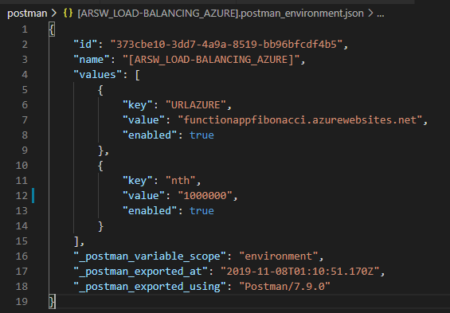
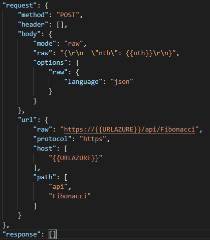
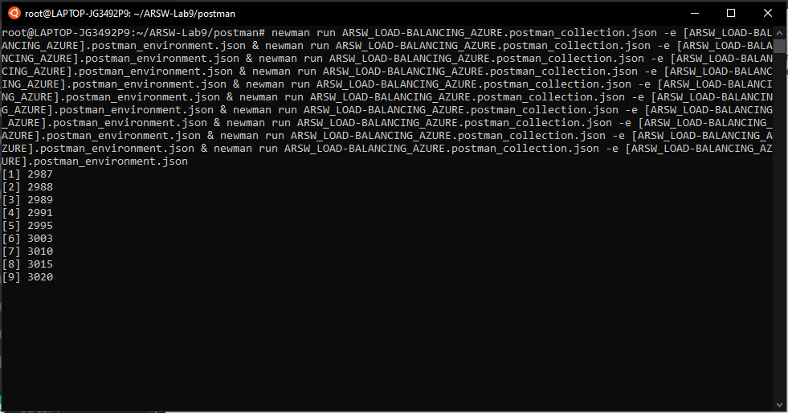
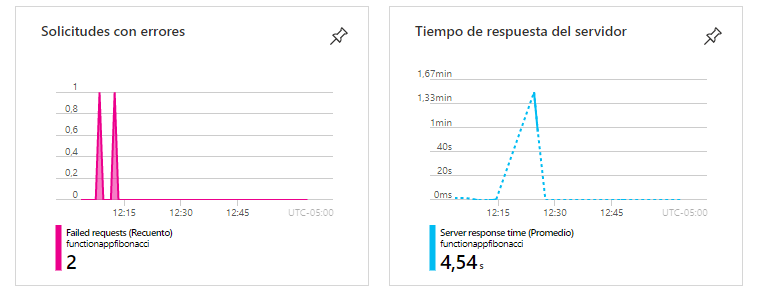
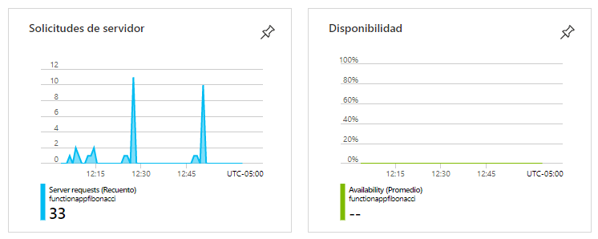
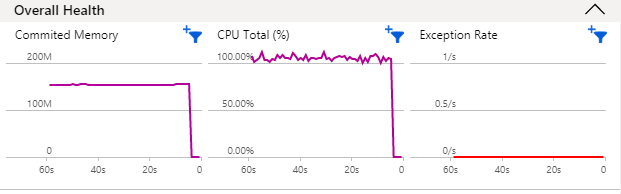
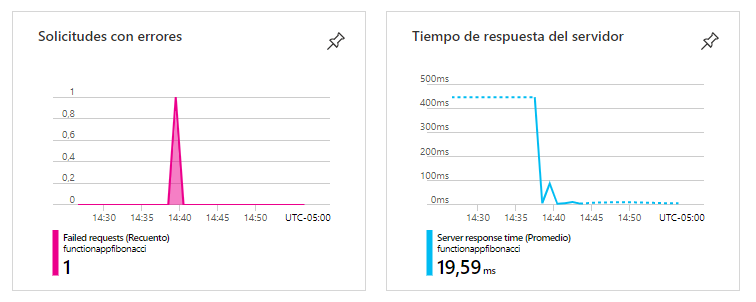
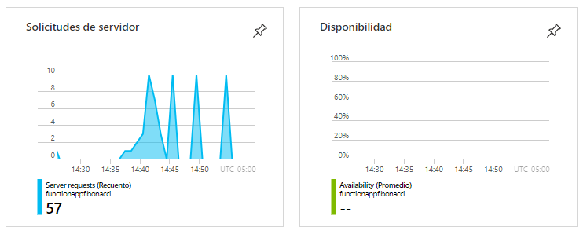
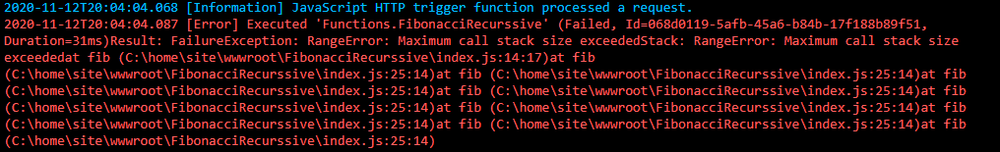

### Escuela Colombiana de Ingeniería
### Arquitecturas de Software - ARSW

## Escalamiento en Azure con Maquinas Virtuales, Sacale Sets y Service Plans

### Dependencias
* Cree una cuenta gratuita dentro de Azure. Para hacerlo puede guiarse de esta [documentación](https://azure.microsoft.com/en-us/free/search/?&ef_id=Cj0KCQiA2ITuBRDkARIsAMK9Q7MuvuTqIfK15LWfaM7bLL_QsBbC5XhJJezUbcfx-qAnfPjH568chTMaAkAsEALw_wcB:G:s&OCID=AID2000068_SEM_alOkB9ZE&MarinID=alOkB9ZE_368060503322_%2Bazure_b_c__79187603991_kwd-23159435208&lnkd=Google_Azure_Brand&dclid=CjgKEAiA2ITuBRDchty8lqPlzS4SJAC3x4k1mAxU7XNhWdOSESfffUnMNjLWcAIuikQnj3C4U8xRG_D_BwE). Al hacerlo usted contará con $200 USD para gastar durante 1 mes.

### Parte 0 - Entendiendo el escenario de calidad

Adjunto a este laboratorio usted podrá encontrar una aplicación totalmente desarrollada que tiene como objetivo calcular el enésimo valor de la secuencia de Fibonnaci.

**Escalabilidad**
Cuando un conjunto de usuarios consulta un enésimo número (superior a 1000000) de la secuencia de Fibonacci de forma concurrente y el sistema se encuentra bajo condiciones normales de operación, todas las peticiones deben ser respondidas y el consumo de CPU del sistema no puede superar el 70%.

### Escalabilidad Serverless (Functions)

1. Cree una Function App tal cual como se muestra en las  imagenes.

2. Instale la extensión de **Azure Functions** para Visual Studio Code.

3. Despliegue la Function de Fibonacci a Azure usando Visual Studio Code. La primera vez que lo haga se le va a pedir autenticarse, siga las instrucciones.

4. Dirijase al portal de Azure y pruebe la function.

5. Modifique la coleción de POSTMAN con NEWMAN de tal forma que pueda enviar 10 peticiones concurrentes. Verifique los resultados y presente un informe.

### Colección Postman

#### Ambiente

#### Solicitud

Para enviar 10 solicitudes concurrentes usamos el aplicativo Newman y el comando & del sistema operativo Linux.

Por medio del análisis de Azure sobre la función se obtuvo lo siguiente:

Por medio de la herramienta Application Insights de Azure se obtuvieron los siguientes resultados:

### Conlusiones

  * Todas las peticiones fueron respondidas efectivamente, pero el uso de la CPU siempre estuvo al máximo; por esta razón no se cumple el escenario plaanteado del laboratorio.
  
  * Aunque la implementación de la función es ineficiente, al desplegarla utilizando un modelo Serverless se obtuvieron resultados exitosos de todos los casos probados, esto nos demuestra la efectividad del servicio Azure Functions.

6. Cree una nueva Function que resuleva el problema de Fibonacci pero esta vez utilice un enfoque recursivo con memoization. Pruebe la función varias veces, después no haga nada por al menos 5 minutos. Pruebe la función de nuevo con los valores anteriores. ¿Cuál es el comportamiento?.

#### Nueva Función

#### Resultados

Al realizar las pruebas con newman se obtuvieron los siguientes resultados con la herramineta de análisis de Azure Functions:

Y por medio de la herramienta Application Insights de Azure se obtuvieron los siguientes resultados:

Los tiempos de respuesta y el consumo de CPU se vieron bastante reducidos con la nueva implementación, después de 5 minutos el tiempo de respuesta a las peticiones incrementó nuevamente debido a que transcurridos 5 minutos de inactividad de la función los datos almacenados en memoria se limpian automáticamente debido a que el plan selecionado al configurar el servicio fue Consumption, el cual tiene limite de tiempo de 5 minutos.

**Preguntas**

* ¿Qué es un Azure Function?

Azure Function es un servicio serverless de Azure que permite ejecutar código como servicio, esto hace que solamente nos tengamos que preocupar por desarrollar la funcionalidad que necesitamos, sin importar la aplicación o la infraestructura para ejecutarlo. Se pueden implementar en varios lenguajes (JavaScript, C#, Python, PHP, etc.), así como en opciones de scripting como Bash, Batch y PowerShell, además puede integrarse con Azure DevOps para procesos de integración continua.

Solo se paga por los recursos consumidos; se factura según el número total de ejecuciones solicitadas para todas las funciones de forma mensual, además el primer millón de ejecuciones es gratis cada mes.

* ¿Qué es serverless?

Serverless es un tipo de arquitectura en el que no se realiza desarrollo sobre servidores, sino que se asigna la responsabilidad de ejecutar un fragmento de código a un proovedor de la nube, este se encarga de realizar una asignación dinámica de recursos, es decir, los escala automáticamente con base en la demanda y los libera cuando no son utilizados.

El código generalmente se ejecuta dentro de contenedores stateless que pueden ser activados por una variedad de eventos desde solicitudes http hasta eventos de Azure Pipelines, sus homólogos en otros proveedores AWS Lambda en Amazon y Cloud Functions en Google Cloud.

* ¿Qué es el runtime y que implica seleccionarlo al momento de crear el Function App?

El runtime es el intervalo de tiempo de ejecución en el cual un programa se ejecuta. En azure esta relacionado con la versión del lenguaje de la función a ejecutar. En este caso utilizamos el plan Consumption y la versión de runtime 12 LTS, lo cual implica que el tiempo de timeout será de 5 minutos y además nuestra memoria se limpiará en este intervalo de tiempo.

* ¿Por qué es necesario crear un Storage Account de la mano de un Function App?

Aunque no requiera asignar un proveedor para utilizar Azure Functions, se requiere asignar un espacio de almacenamiento para poder ejecutar el código, para esto se usa Azure Storage, este servicio se encargará de las operaciones de almacenamiento y administración como son Manejo de triggers y logs.

* ¿Cuáles son los tipos de planes para un Function App?, ¿En qué se diferencias?, mencione ventajas y desventajas de cada uno de ellos.

#### Consumption plan 

Ofrece escalabilidad dinámica y factura solo cuando la aplicación es ejecutada, tiene un timeout es de 5 minutos y brinda una memoria máxima de 1.5 GB por instancia, un almacenamiento de 1 GB y un máximo número de instancias de 200.

#### Premium plan

Ofrece escalabilidad dinámica, se factura por el número en segundos de core y la memoria usada en las distintas instancias, puede tener timeouts ilimitados, memoria por instancia de 3.5 GB y un almacenamiento de hasta 250 GB, finalmente ofrece un máximo de 100 instancias.

#### Dedicated plan

El cliente puede implementar manualmente la escalabilidad, puede tener timeouts ilimitados, memoría por instancia de 1.7 GB y una capacidad de almacenamiento hasta de 1000 GB y el numero de instancias es máximo 20. En este plan se paga lo mismo que por otros recursos de App Service, como las aplicaciones web.

* ¿Por qué la memoization falla o no funciona de forma correcta?

Falla debido a que el plan utilizado al crear la Azure Function (Consumption) nos ofrece 1.5 GB por instancia, este tamaño es muy poco a la hora de hacer peticiones con números muy grandes, esto genera que el stack de memoria se llené, esto se ve reflejado con la siguiente excepción.

* ¿Cómo funciona el sistema de facturación de las Function App?

Azure Functions factura según el consumo de recursos y las ejecuciones por segundo. Los precios del plan de consumo incluyen 1 millones de solicitudes y 400.000 GB de consumo de recursos gratuitos al mes, después de esto se factura según el consumo de recursos medido en GBs. El consumo de recursos se calcula multiplicando el tamaño medio de memoria en GB por el tiempo en milisegundos que dura la ejecución de la función. La memoria que una función utiliza se mide redondeando a los 128 MB más cercanos hasta un tamaño de memoria máximo de 1.536 MB, y el tiempo de ejecución se redondea a los 1 ms más cercanos. Para la ejecución de una única función, el tiempo de ejecución mínimo es de 100 ms y la memoria mínima es de 128 MB.

* Informe
