# Escuela Colombiana de Ingeniería Julio Garavito - Arquitecturas de Software ARSW - Parcial Segundo Tercio

# Open Weather Map

Aplicación Web de obtención de infomación meteorlógica en todo el mundo.

Desarrollador: Daniel Felipe Walteros Trujillo

[](https://walteros-arsw-t2.herokuapp.com/)

[Enlace Git](https://github.com/Silenrate/WALTEROS-ARSW-T2)

## Diseño

### Diagrama de Componentes

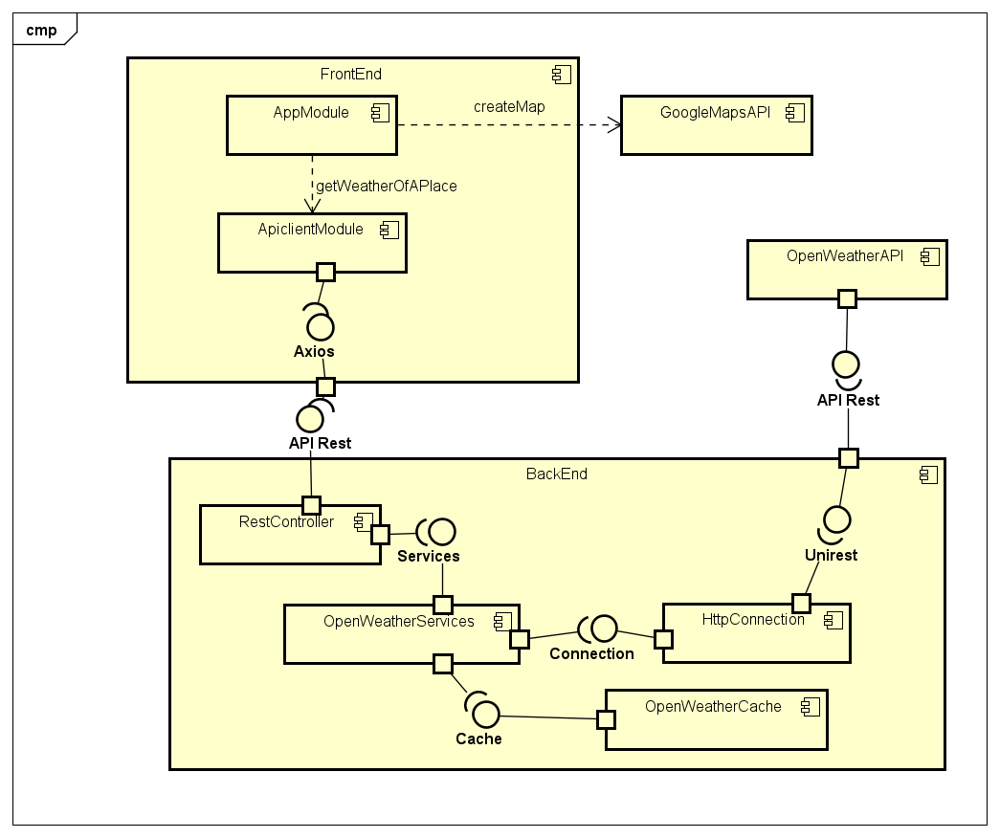

### Diagrama de Despliegue

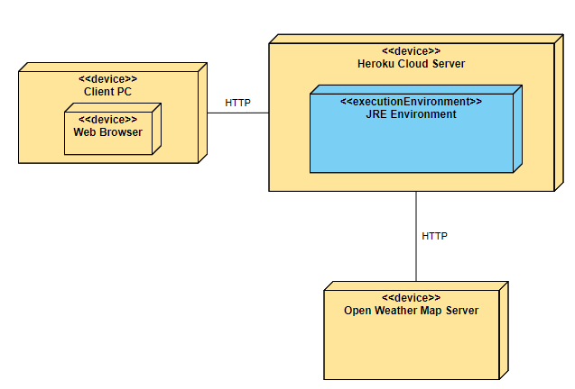

## Requisitos para Ejecución de forma local

- Maven
- Java Versión 8 o Superior

## Instrucciones de Ejecución Local

1) Cambiar la variable de url en apiclient.js localizado en src/main/reources/static/js por `http://localhost:8080/weather`

    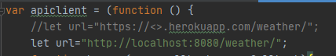

2) Ubicarse en la carpeta `WALTEROS-ARSW-T2` y desde el cmd de windows utilizar los siguientes comandos:
 
3) Para compilar `mvn package`

    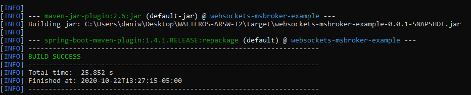

4) Para ejecutar las pruebas `mvn test`

    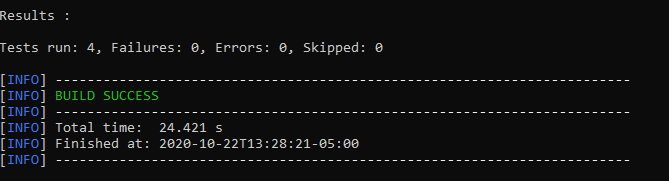

5) Para ejecutar la aplicacion `mvn spring-boot:run` y dirigirse a la direccion [http://localhost:8080/](http://localhost:8080/) en cualquier web browser

    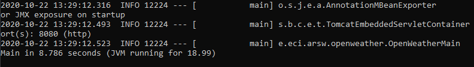

## Intrucciones de Uso

1) En el buscador ingresar el lugar del cual se quieren conocer la información meteorológica y presionar el boton "Search"

    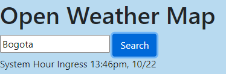

2) Se cargará el nombre del lugar, el codigo de su país y la informaci+on meteorológica; esta consiste en una imagen que describe el tipo de clima, la temperatura actual, la sensación térmica, la velocidad del viento, la presión atmosférica y el porcentaje de humedad.

    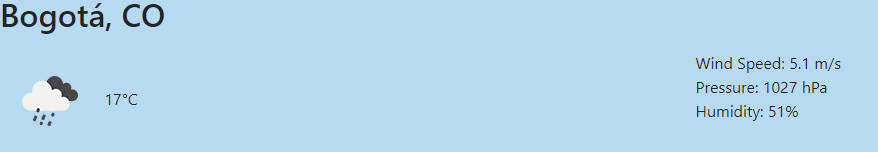

4) Al final se encuentra un mapa con la ubicación del lugar buscado, el zoom del mapa a veces se carga de forma excesiva, por lo cual a veces se tiene que persionar el boton - del mapa varias veces para poder visualizarlo.

    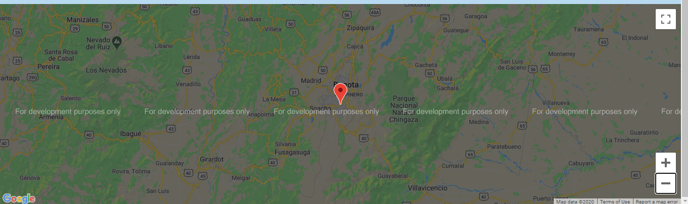

## Realizar Cambios de Dependencias

### Realizar cambios en la obtención de la infomración meteorológica

En la clase de servicios, se obtienen los datos por medio de una interfaz inyectada con spring boot

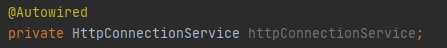

Por esta razón, para cambiar la forma en la que se obtienen los datos de la información meteorológica se puede realizar de dos formas:

- Implementando un clase que implemente la interfaz HttpConnectionService si se van a tomar de otra forma.
- Alterando los atributos url y appId en la clase OpenWeatherConnectionService si van a tomarse de la misma forma, pero de otro recurso.

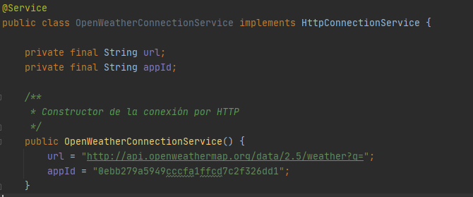

### Realizar cambios en la implementación de los servicios

La clase de servicios es utilizada por el controlador por medio de una interfaz inyectada con spring boot

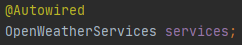

Por esta razón, para cambiar la forma en la que la capa se servicios funciona se puede implementar un clase que implemente la interfaz OpenWeatherServices.

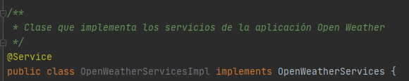

### Realizar cambios en la implementación de la página web

Para realizar otro javascript que implemente esta aplicación, basta con cambiar el atributo apiclient del app.js ubicado en src/main/resources/static/js por el nombre del modulo desarrollado.

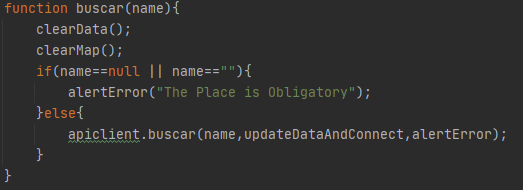

### Realizar cambios en la implementación del caché

En la clase de servicios, se implementa el caché por medio de una interfaz inyectada con spring boot

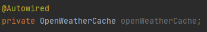

Por esta razón, para cambiar la forma en la que los datos se guardan en caché se puede implementar un clase que implemente la interfaz OpenWeatherCache.

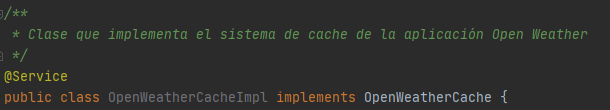

Para cambiar el tiempo que se almacenan los datos en cache hay que cambiar la variable MINUTES_IN_CACHE en OpenWeatherCacheImpl.

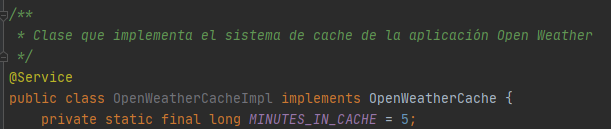

## Enunciado del Parcial

Con el objetivo de preparar el examen final del segundo tercio, por favor siga las siguientes instrucciones.

1. Explore el API de OpenWeather en el siguiente [enlace](https://openweathermap.org/ ).
2. Use la colección de Postman adjunta para validar el funcionamiento del endpoint por fuera de la página de OpenWeather.
3. Si no ha terminado por completo el último laboratorio, hagalo, si es necesario desde el inicio y completo. En ese laboratorio esta basado el parcial.
4. Revise la documentación de Google Maps para agregar marcadores a un mapa o revise este [Codepen](https://codepen.io/SitePoint/pen/YWKLzv?editors=0110)

## Descripción del Problema a Solucionar

Parcial del segundo tercio

Su compañía lo ha seleccionado para construir una aplicación para consultar el estado del clima en lugares específicos de la tierra.  

La aplicación recibirá en un campo el nombre de una ciudad, por ejemplo `London` para Londres y deberá mostrar la información del clima para esa ciudad. Para esto utilice el API gratuito de [openweathermap](https://openweathermap.org/ ) (Puede crear una cuenta para obtener la llave para realizar consultas). Se le pide que su implementación sea eficiente en cuanto a recursos así que debe implementar un caché que permita evitar hacer consultas repetidas al API externo. Una vez tenga la funcionalidad básica, extienda su implementación para incluir una funcionalidad para mostrar mapas de la ciudad con diferentes capas del clima (revise la funcionalidad del API de mapas de clima y el ejemplo anexo.). La implementación del mapa puede ir directamente a los servicios externos sin pasar por el servidor intermediario.
Sugerencia realice la implementación de manera incremental. Haga commits regulares.

Ejemplo de la interfaz gráfica

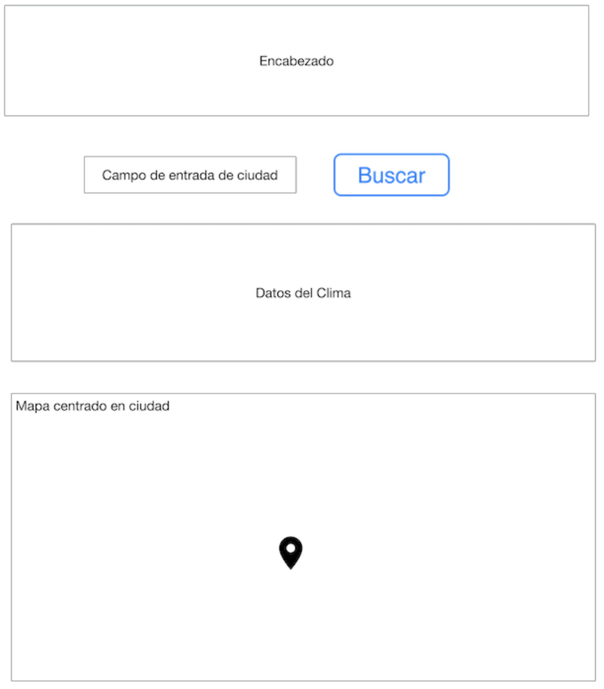

La arquitectura debe tener las siguientes características.

1. El cliente Web debe ser un cliente asíncrono que use servicios REST desplegados en Heroku y use Json como formato para los mensajes.
2. La aplicación debe estar desplegada en Heroku.
3. El servidor de Heroku servirá como un gateway para encapsular llamadas a otros servicios Web externos.
4. La aplicación debe ser multiusuario (Sin registro y sin seguridad )
5. Todos los protocolos de comunicación serán sobre HTTP.
6. Los formatos de los mensajes de intercambio serán siempre JSON.
7. La interfaz gráfica del cliente debe ser los más limpia y agradable posible y debe utilizar Bootstrap. Para invocar métodos REST desde el cliente usted puede utilizar la tecnología que desee.
8. Debe construir un cliente Java que permita probar las funciones tanto del servidor fachada como del cliente externo. El cliente utiliza simples conexiones http para conectarse a los servicios. Este cliente debe hacer pruebas de concurrencia a sus servidor Spring.
9 .La fachada de servicios tendrá un caché que permitirá que llamados que ya se han realizado a las implementaciones concretas con parámetros específicos no se realicen nuevamente. Puede almacenar el llamado como un String con su respectiva respuesta, y comparar el string respectivo. Recuerde que el caché es una simple estructura de datos.
10. Si el dato del cache tiene más de 5 min se debe solicitar nuevamente al servidor externo.
11. Se debe poder extender fácilmente, por ejemplo, es fácil agregar nuevas funcionalidades, o es fácil cambiar el proveedor de una funcionalidad.
12. Debe utilizar maven para gestionar el ciclo de vida, git y github para almacenar al código fuente y heroku como plataforma de producción.

## Entrega

1. La aplicación funcionando en Heroku con el nombre (APELLIDO-ARSW-T2) y el código fuente almacenado en un proyecto GitHub con el nombre (APELLIDO-ARSW-T2).
2. Los fuentes deben estar documentados y bien estructurados para generar el Javadoc.
3. El Readme.md debe describir el diseño, la forma de ejecutar el progrema localmente, explicar cómo se puede extender y cómo podría, por ejemplo, hacer que una función específica la implementara un proveedor de servicios diferente.
4. Indique la urls de Github, Heroku
5. Suba el zip del proyecto al aula con el nombre (APELLIDO-ARSW-T2).
6. Guarde una copia de su proyecto.

## Criterios de evaluación:

1. Cliente escrito en JS asíncrono invocando servicios REST (10%)
2. Servidor fachada exponiendo servicios REST (10%)
3. Conexión a servicios externos (10%)
4. Cliente Java para Tests concurrentes  para el servicio en Heroku y para el del proveedor externo(10%)
5. Cache tolerante a la concurrencia y una sola instancia para la aplicación (10%)
6. Implementa la funcionalidad de los mapas de manera asíncrona (15%)
7. Diseño y descripción del diseño son de alta calidad (30%)
    * Extensible
    * Usa patrones
    * Modular
    * Organizado
    * Javadoc publicado
    * Identifica la función de componentes individuales demuestra conocimiento del funcionamiento general de la arquitectura.
    
## Ayuda

* Inicie con la aplicación web basada en spring que le propone Heroku en su guía inicial para java. (https://devcenter.heroku.com/articles/getting-started-with-java)
* Para invocar un servicios get desde java puede hacerlo de manera fácil con:

```java
import java.io.BufferedReader;
import java.io.IOException;
import java.io.InputStreamReader;
import java.io.OutputStream;
import java.net.HttpURLConnection;
import java.net.URL;

public class HttpConnectionExample {

    private static final String USER_AGENT = "Mozilla/5.0";
    private static final String GET_URL = "https://www.alphavantage.co/query?function=TIME_SERIES_DAILY&symbol=fb&apikey=Q1QZFVJQ21K7C6XM";

    public static void main(String[] args) throws IOException {

        URL obj = new URL(GET_URL);
        HttpURLConnection con = (HttpURLConnection) obj.openConnection();
        con.setRequestMethod("GET");
        con.setRequestProperty("User-Agent", USER_AGENT);
        
        //The following invocation perform the connection implicitly before getting the code
        int responseCode = con.getResponseCode();
        System.out.println("GET Response Code :: " + responseCode);
        
        if (responseCode == HttpURLConnection.HTTP_OK) { // success
            BufferedReader in = new BufferedReader(new InputStreamReader(
                    con.getInputStream()));
            String inputLine;
            StringBuffer response = new StringBuffer();

            while ((inputLine = in.readLine()) != null) {
                response.append(inputLine);
            }
            in.close();

            // print result
            System.out.println(response.toString());
        } else {
            System.out.println("GET request not worked");
        }
        System.out.println("GET DONE");
    }

}
```

*  Parseo de un JSON

```html
<!DOCTYPE html>
<html>
<body>

<h2>Create Object from JSON String</h2>

<p id="demo"></p>

<script>
var txt = '{"name":"John", "age":30, "city":"New York"}'
var obj = JSON.parse(txt);
document.getElementById("demo").innerHTML = "name: " + obj.name + ", age: " + obj.age;
</script>

</body>
</html>

```

* Código de página con Mapa embebido [(Ver archivo)](index.html)
    
